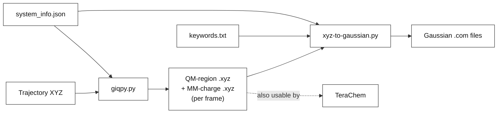

<div align="center">

# GIQPy

**G**enerate **I**nputs for **Q**M/MM systems in **Py**thon

Turn a molecular-dynamics trajectory into ready-to-run QM/MM inputs for monomers,
dimers, and aggregates with automatic QM/MM solvent partitioning and functionality to 
export them as **Gaussian** `.com` files.


</div>

---
## Why GIQPy?

Setting up excited-state QM/MM calculations for solvated chromophore aggregates is fiddly:
you have to slice the trajectory into monomers, decide which solvent molecules are quantum
vs. point-charge, keep charges and spin multiplicities straight, and format everything for
your QM package. GIQPy automates all of it.

**Highlights**

- 🧩 **Monomers, dimers & aggregates** — generate isolated-monomer, full-aggregate, and
  EET-analysis (EETG) inputs from the same trajectory.
- 💧 **QM/MM solvent partitioning** — pick a QM solvent shell by radius; treat the rest as MM point charges (or auto-detect them).
- 🎯 **Guaranteed-unique QM solvent** *(see callout below)*.
- 🔌 **Embedding options** — embed the *other* monomers as zero charges or as explicit MM charges.
- 🎬 **Trajectory-aware** — process one frame or thousands; each frame lands in its own folder.
- 🏷️ **You name things** — output files are named from labels you choose in the JSON.
- 🧪 **Package-agnostic core** — the primary output is QM/MM `.xyz` files usable with any QM
  package (e.g. TeraChem); generating **Gaussian** `.com` inputs is an optional second step.

> [!IMPORTANT]
> **Unique QM solvent per monomer.** When several solute molecules share a solvent shell,
> each solvent molecule within the cutoff is assigned to the **single nearest** monomer
> (by minimum atom–atom distance). No solvent atom is ever shared between two monomers'
> QM regions, while the aggregate QM region is exactly the union of all selected solvent molecules.

---

## How it works

GIQPy is a two-stage pipeline. Stage 1 is geometry; stage 2 is QM-package formatting.



| Stage | Script | In → Out |
|------:|--------|----------|
| **1** | `giqpy.py` | trajectory `.xyz` + `system_info.json` → per-frame QM-region & MM-charge `.xyz` files |
| **2** | `xyz-to-gaussian.py` | those `.xyz` files + `keywords.txt` → Gaussian `.com` inputs |

`run-giqpy.sh` is a thin wrapper that runs both stages back-to-back.

---

## Installation

GIQPy is a set of standalone scripts — just clone and run.

```bash
git clone https://github.com/sayan919/GIQPy.git
cd GIQPy
pip install numpy        # the only third-party dependency
```

**Requirements:** Python ≥ 3.8 and NumPy. Everything else is from the standard library.

---

## Quick start

```bash
# Stage 1 — generate QM-region + MM-charge XYZ files
python giqpy.py \
    --traj my_traj.xyz --num-frames 1 --num-monomers 2 \
    --system-info examples/cv_dimer_water.json \
    --qm-radius 5 --mm-solvent

# Stage 2 — build Gaussian .com files from those XYZ files
python xyz-to-gaussian.py \
    --input-dir . --num-monomers 2 \
    --system-info examples/cv_dimer_water.json \
    --gauss-keywords examples/keywords.txt --com-files both
```

> 💡 **Single frame?** Pass `--num-frames 1`. **Whole trajectory?** Omit `--num-frames`.

---

## Input files

### 1. Trajectory (`--traj`)

A standard multi-frame XYZ file (each frame = atom-count line, comment line, then `element x y z` rows).
Which atoms belong to which monomer/solvent is decided by the `index` field in `system_info.json` (below).

### 2. `system_info.json` (`--system-info`)

A **JSON array**: one entry per monomer, followed by **exactly one** solvent entry.

```jsonc
[
  {
    "system"      : "m1",            // label used to NAME this system's output files
    "name"        : "cv",            // descriptive name shown in titles/comments
    "mol_formula" : "C16H12N3O1",
    "nAtoms"      : 32,
    "index"       : "0-31",          // 0-based atom indices for this monomer in the trajectory
    "charge"      : 1,
    "spin_mult"   : 1
  },
  {
    "system"      : "m2",
    "name"        : "cv",
    "mol_formula" : "C16H12N3O1",
    "nAtoms"      : 32,
    "index"       : "32-63",
    "charge"      : 1,
    "spin_mult"   : 1
  },
  {
    "system"      : "solvent",
    "name"        : "water",
    "mol_formula" : "H2O",
    "nAtoms"      : 3,               // atoms per solvent MOLECULE (for grouping)
    "index"       : "64-",           // atom 64 → end is solvent
    "charges": [
      { "element": "O", "charge": -0.834 },
      { "element": "H", "charge":  0.417 },
      { "element": "H", "charge":  0.417 }
    ]
  }
]
```

| Field | Applies to | Meaning |
|-------|------------|---------|
| `system` | monomer | Short label used to **name output files** (`m1-qm.xyz`, `m1.com`). Use `m1`/`mA`/anything. Falls back to `monomer1`, `monomer2`, … if omitted. |
| `name` | monomer, solvent | Descriptive name shown in `.xyz`/`.com` **titles & comments** (not filenames). |
| `index` | monomer, solvent | 0-based atom selection from each frame (see below). |
| `nAtoms` | monomer, solvent | Monomer: atom count (optional when `index` given — cross-checked if both). **Solvent: atoms per molecule, always required.** |
| `mol_formula` | monomer, solvent | Chemical formula; for the solvent it drives molecule grouping. |
| `charge`, `spin_mult` | monomer | Charge and spin multiplicity used in the `.com` files. |
| `charges` | solvent | Per-atom MM point charges (one entry per atom of one solvent molecule). |

**The `index` spec** (0-based) controls exactly which trajectory atoms each system owns:

| Example | Selects |
|---------|---------|
| `"0-31"` | atoms 0 through 31 (inclusive) |
| `"64-"` | atom 64 through the end (handy for solvent) |
| `"0-9,20-31"` | multiple ranges — atoms need **not** be contiguous |

- With `index`, the trajectory atom order is **flexible** — cores need not come first.
- Ranges **must not overlap** between systems; out-of-range or overlapping indices raise a clear error.

<details>
<summary><b>Legacy mode (no <code>index</code>)</b></summary>

If **no** monomer defines `index`, GIQPy falls back to sequential slicing by `nAtoms`,
assuming the classic layout `[monomer1 … monomerN][solvent …]`. Existing inputs keep working unchanged.
</details>

### 3. Gaussian keywords (`--gauss-keywords`)

Plain text, one route-section line per blank-stripped line:

```text
#p CAM-B3LYP/6-31G*                 ! Functional/basis set
# TDA(Nstates=6)                    ! Excited-state calculation
# Density(Transition=1)             ! S0->S1 transition density
# NoSymm                            ! No symmetry (dimers)
```

> When MM charges are present, GIQPy automatically inserts a `# charge` keyword if you didn't include one.

### 4. Charge files (optional)

<details>
<summary><b>Formats for <code>--mm-monomer</code> and a file-based <code>--mm-solvent</code></b></summary>

**Inter-monomer charges (`--mm-monomer file1 file2 …`)** — four columns `charge x y z`, no header.
Provide **N** files when `--num-monomers N`; each monomer is then embedded in the charges of all the others.

```text
-0.123   1.234   0.456   -2.345
 0.417   2.345   1.567    0.890
…
```

**Explicit MM solvent (`--mm-solvent path/to/file`)** — same `charge x y z` columns, but **with two XYZ-style header lines** (atom count + comment) that are skipped.
</details>

---

## Output files

Everything for a frame lands in that frame's folder (`1/`, `2/`, … for trajectories).
`{term}` is **`dimer`** when `--num-monomers 2`, otherwise **`aggregate`**; `{system}` is your JSON `system` label.

```text
./1/
├── dimer-qm.xyz          # aggregate QM region  (all cores + all QM solvent)
├── m1-qm.xyz             # monomer QM region    (core + its UNIQUE QM solvent)
├── m2-qm.xyz
├── dimer-mm.xyz          # aggregate MM charges (MM solvent only)        ┐ only when
├── m1-mm.xyz             # monomer MM charges   (embedding + MM solvent) │ MM is
├── m2-mm.xyz             #                                               ┘ requested
├── dimer-qm-mm.com       # Gaussian inputs (suffix reflects QM/MM solvent)
├── m1-qm-mm.com
└── m2-qm-mm.com
```

| Producer | File | Contents |
|----------|------|----------|
| `giqpy.py` | `{term}-qm.xyz` | Aggregate QM region (cores + all QM solvent). |
| `giqpy.py` | `{system}-qm.xyz` | One monomer's QM region (core + its unique QM solvent). |
| `giqpy.py` | `{term}-mm.xyz` | Aggregate MM charges — **MM solvent only**. |
| `giqpy.py` | `{system}-mm.xyz` | Monomer MM charges — other-monomer embedding **+** MM solvent. |
| `xyz-to-gaussian.py` | `{system}{suffix}.com` | Per-monomer Gaussian input. |
| `xyz-to-gaussian.py` | `{term}{suffix}.com` | Aggregate/dimer Gaussian input. |
| `xyz-to-gaussian.py` | `{term}-eetg{suffix}.com` | EET-analysis dimer input (`--eetg`). |

The `{suffix}` encodes the solvent treatment: `-qm`, `-mm`, `-qm-mm`, or nothing.
MM `.xyz` files store `charge x y z` (not `element x y z`); their header line says so.

---

## Command-line reference

### `giqpy.py` — trajectory → QM/MM XYZ files

| Flag | Required | Default | Description |
|------|:--------:|---------|-------------|
| `--traj` | ✅ | — | Multi-frame trajectory XYZ (use `--num-frames 1` for one frame). |
| `--num-monomers` | ✅ | — | Number of core monomer units. |
| `--system-info` | ✅ | — | `system_info.json` (monomer + solvent metadata). |
| `--num-frames` | — | all | Number of frames to process. |
| `--qm-radius` | — | `5.0` | QM-solvent shell radius (Å). **Negative disables QM solvent.** |
| `--mm-monomer` | — | off | `0` = embed other monomers as zero charges; or one charge file per monomer. |
| `--mm-solvent` | — | off | Flag alone = auto-charge non-QM solvent from JSON; or a path to a charge file. |
| `--log-file` | — | `giqpy-run.log` | Log file name. |

### `xyz-to-gaussian.py` — XYZ files → Gaussian `.com`

| Flag | Required | Default | Description |
|------|:--------:|---------|-------------|
| `--num-monomers` | ✅ | — | Must match the `giqpy.py` run. |
| `--system-info` | ✅ | — | Same JSON (provides charge / spin / names). |
| `--gauss-keywords` | ✅ | — | Gaussian route-section keywords file. |
| `--input-dir` | — | `.` | Folder with the XYZ files, or a parent of numbered frame folders. |
| `--com-files` | — | `both` | Which inputs: `monomer`, `dimer`, or `both`. |
| `--eetg` | — | off | Generate **only** the EETG dimer input (requires `--num-monomers 2`). |
| `--tag` | — | — | Custom tag appended to `.com` filenames (e.g. `m1-qm-mm-TAG.com`). |
| `--log-file` | — | `xyz-to-gaussian.log` | Log file name. |

---

## Notes & tips

- **Solvent treatments combine freely:** none, QM only, MM only, or QM + MM.
- **MM solvent auto-detection** (`--mm-solvent` with no path) assigns charges to every
  non-QM solvent molecule using the `charges` template in the JSON, matching by atom position.
- **Embedding semantics:** the aggregate `.com` carries MM solvent only; each monomer `.com`
  additionally carries the other monomers' charges (zero or explicit, per `--mm-monomer`).
- **Logging:** progress prints to the console; full details (and stack traces on failure) go to
  the log file. A bad frame in a trajectory is skipped with a warning rather than aborting the run.
- **Housekeeping:** per-frame scratch files (`current-frame.xyz`) are removed automatically.

---

## Acknowledgements

Developed with ♥ by *Sayan Adhikari* and *Claude*.
